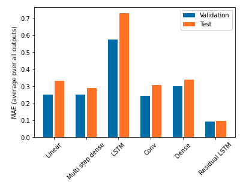

# AQI-analysis
## Introduction
It is a research project at Stanford University in 2020. The project is a Time Series Forecasting topic. The languages and relevent packages are **Python - Tensorflow - Keras - Scikit-learn**. The project aims to predict short-term and long-term air quality index (AQI) in Bangkok, Thailand using weather, wind and historical air quality index. 
## Dataset
The datasets consist of four different datasets, air quality, weather and taxi traffic dataset. The air quality dataset is hourly dataset from Jan 2018 to May 2020 in 13 air stations in Bangkok, consisting of historical air quality index. The weather dataset is hourly dataset from Jan 1985 to Jun 2020, consiting of 41 features, including precipitation, cloud cover rate, evaporation rate, wind direction, so on. Both datasets are downloaded from public website of Thailand government. The taxi traffic dataset is secondly dataset for 2019, consisting of gps, accelaration, speed, and vehicle id for each taxi. The dataset is privately owned. The three datasets are merged, cleaned and preprocessed into one single datset. The final dataset has 8593 rows and 262 columns.
## Preprocess
The columns are selected using xgboosting feature importance with cross validation.
## Model
For short term prediction (next 1 hour), the models include lasso, random forest, boosting, svr, DNN, CNN, LSTM, and Residual LSTM . The loss is MSE. 

For long term prediction (next 24 hours), the models include DNN, CNN, LSTM (output 24 hours at a time), Autoregressive LSTM (first next hour prediction will be the input for the next hour's prediction)
## Result
<figure>
  
</figure>
<figure>
  
</figure>
For short-term prediction, residual lstm perform the best, having the lowest test MAE. For long-term prediction, CNN perform the best, having the lowest test MAE. 
## Visualzation
<figure>
  
</figure>
The result also visualized on the mapbox platform [link](https://www.youtube.com/watch?v=F2fkRrdLGEQ)
